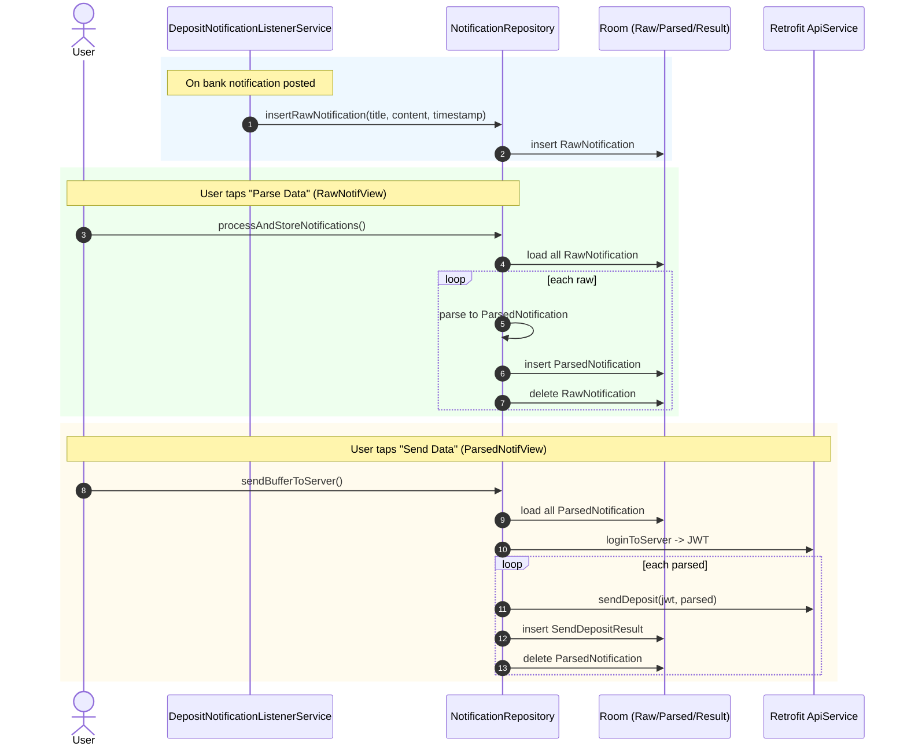

# 알림 분석 및 전송 과정 구조

> 최초 작성일: 2025-08-21
>
> 최신 개정일: 2025-08-21
>
> 최신 개정자: [이한경TI](mailto:tteokgook@gmail.com)
>
> 작성자: [이한경TI](mailto:tteokgook@gmail.com)

## 개괄

- `notification.DepositNotificationListenerService`: 알림 수집 서비스
- `db.NotificationRepository`: Room DB
    - `db.RawNotification`: 원본 알림
    - `db.ParsedNotification`: 분석된 알림
    - `db.SendDepositResult`: 서버 요청 결과
- `api.ApiService`: 서버 전송 API. Retrofit2를 사용한다.
- `MyApplication`: 전역 상태 저장. `NotificationRepository`를 가지고 있다.

- 알림을 수집한 뒤 `RawNotification`에 저장되고 `ParsedNotification`를 거쳐 최종 처리 결과가 `SendDepositResult`에 저장됩니다.

## 알림 수집

- `DepositNotificationListenerService`를 통해 알림을 수집하며, 이 서비스는 `app/src/main/AndroidManifest.xml`에 등록되어
  있습니다.
- 서비스는 모든 알림을 수집하고 읽으며, 특정 은행 앱 패키지명과 일치하는 알림만 `RawNotification`로 저장합니다.
- `NotificationRepository`를 통해 원본 알림을 저장하며, 저장이 완료된 후 알림 분석을 수행합니다.

## 알림 분석

- 새로운 `RawNotification`이 등록되거나 버튼 클릭을 통해 알림 분석이 요청되면 알림 분석을 수행합니다.
- 알림의 제목과 내용에서 입금액, 입금자명을 추출하고, 알림 발생 시각에서 입금 시각을 추출합니다.
- 알림 분석은 알림 단위로 수행합니다.
    - 추출된 셋은 `ParsedNotification`로 저장하고 해당 원본 알림은 `RawNotification`에서 삭제됩니다.
    - 분석에 실패한 알림은 삭제되지 않고 `RawNotification`에 남습니다.
- `NotificationRepository`를 통해 분석된 알림을 저장하며, 저장이 완료된 후 알림 전송을 수행합니다.

## 알림 전송

- 새로운 `ParsedNotification`이 등록되거나 버튼 클릭을 통해 알림 전송이 요청되면 알림 전송을 수행합니다.
- 먼저 서버로 로그인 요청을 보내서 jwt를 발급합니다.
- 이후 알림 전송은 알림 단위로 수행합니다.
    - `ParsedNotification`의 정보를 body에 담아서 요청을 전송하고, 응답을 `SendDepositResult`로 저장합니다.
    - 전송에 실패한 알림은 삭제되지 않고 `ParsedNotification`에 남습니다.
- `NotificationRepository`를 통해 알림 전송 결과를 저장합니다.
